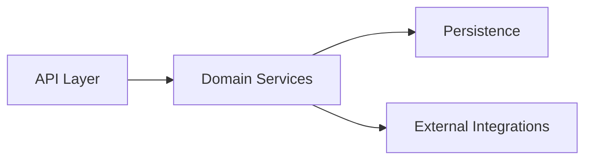

# compass — Specification

> Status: **Draft 0** (pre-implementation). This document is the contract. Implementation follows on approval.
> Date: 2026-05-11
> Author: Ashok Naik
> Inspired by: [CodeBoarding/CodeBoarding](https://github.com/CodeBoarding/CodeBoarding) (Python). This is a TypeScript-native, deliberately-slim port for the Claude Code plugin ecosystem, focused on the MERN stack (JavaScript/TypeScript).

---

## 1. Thesis

> **You can't review architecture you can't see.**

AI agents now write code faster than humans can read it. The pull-request diff shows *what* changed; it never shows *where in the system* it landed. Reviewers approve plausible-looking diffs against an architecture they can no longer hold in their head, and the second-order consequences — a leaky boundary here, a duplicate concept there, a circular dependency back — surface in production weeks later.

`compass` is a Claude Code plugin that keeps an architectural map of your codebase next to the code itself. It parses your JavaScript/TypeScript project, builds an import-and-call graph, asks an LLM to cluster the graph into named components, and writes Mermaid diagrams plus per-component Markdown into `.compass/`. On every re-run it does the smallest amount of work possible — only the components touched by your last commit get re-analyzed.

The shorthand: **Parse → Cluster → Name → Render.** Re-runs are git-diff-driven, so the map stays cheap to keep in sync.

---

## 2. Scope — What ships in v1

We deliberately ship a **slim** subset of the CodeBoarding feature set. Six features only:

| # | Feature | One-line definition |
|---|---------|---------------------|
| 1 | **Full analysis** | Walk the repo, parse with tree-sitter, build the call/import graph, group into components, render |
| 2 | **Mermaid diagrams** | Every overview + component page emits a `graph LR` block ready to paste into PRs/docs |
| 3 | **Incremental analysis** | On re-run, only re-analyze files changed since the last run (git diff vs. cached manifest) |
| 4 | **`.compassignore`** | Gitignore-style exclude file at the repo root so vendored / generated dirs are skipped |
| 5 | **Cluster grouping (LLM)** | Pre-cluster the call graph by co-call frequency, then a single `claude -p` call *names and groups* clusters into components |
| 6 | **Depth levels** | `--depth N` recursively expands each top-level component into its own sub-diagram |

**Architecture concern (not a feature):** a **pluggable backend interface** so non-Claude runtimes (Codex, OpenAI, local models) can be added later without rewriting. v1 ships **Claude only**.

**Language scope:** TypeScript + JavaScript (`.ts`, `.tsx`, `.js`, `.jsx`, `.mjs`, `.cjs`). MERN-focused. Other languages are a v2 conversation.

### 2.1 Explicitly out of scope for v1

The following exist in CodeBoarding and are **deliberately omitted** here. Adding them is a v2 conversation.

- LSP-based static analysis (we use **tree-sitter** instead — single npm dep, no spawned binaries)
- Languages beyond JS/TS (Python, Go, Java, PHP, Rust, C# in upstream)
- Multi-provider LLM (OpenAI, Gemini, Bedrock, Ollama, OpenRouter — we use `claude -p`, no `@anthropic-ai/sdk`)
- HTML / MDX / Sphinx renderers (Markdown + Mermaid only)
- Multi-agent pipeline (planner / abstraction / details / meta-validator — we run a single LLM grouping call)
- Partial analysis (regenerate one component by ID — depth levels covers the same need differently)
- Remote-repo URLs (`compass` runs in-session on an already-cloned repo)
- GitHub Action / CI integration (separate v2 deliverable)
- VS Code / Open VSX extension (Claude Code is the host)
- Health endpoint / hosted service (`health_main.py` upstream)
- Monitoring / streaming stats writer
- Semantic vs. cosmetic diff classification

---

## 3. Distribution & Runtime Model

### 3.1 Distribution
`compass` ships as a **Claude Code plugin** installable via the marketplace:

```bash
claude plugin marketplace add AshokNaik009/compass
claude plugin install compass@compass
```

Once installed, every command is a slash-command-style trigger inside a Claude Code session.

### 3.2 Runtime
Skills are markdown files (`SKILL.md`) that Claude reads and follows. When deterministic work is needed, the skill instructs Claude to invoke a TypeScript script via the bash tool:

```bash
npx tsx ${CLAUDE_PLUGIN_DIR}/scripts/<step>.ts --state .compass/state.json [args...]
```

`tsx` runs TypeScript inline — no compile step in dev. For shipping we still run `tsc` to produce a `dist/` so runtime startup stays fast on cold installs (optional fallback to `tsx`).

### 3.3 LLM access
Two patterns, both using the user's existing Claude Code authentication — **no separate `ANTHROPIC_API_KEY` required**:

1. **In-session LLM work**: skills tell the active Claude session to do the LLM thinking (cluster naming, component descriptions) directly, then write results back via a recording script.
2. **Headless LLM work inside scripts**: when a script needs LLM judgment without user attention (e.g., looping over each component to draft a description), it shells out to `claude -p "<prompt>"` via `child_process.execSync`. Output is parsed (typically structured JSON requested in the prompt).

**Consequence:** the package has **zero AI SDK dependencies**. No `@anthropic-ai/sdk`, no `openai`, nothing. The "intelligence" lives in skill prompts and `claude -p` calls; the scripts are pure deterministic plumbing.

---

## 4. Architecture

### 4.1 High-level

```
┌─────────────────────────────────────────────────────────┐
│                Claude Code (host)                       │
│                                                         │
│  ┌───────────────────────────────────────────────────┐  │
│  │  Skills (Markdown — instructions for Claude)      │  │
│  │  skills/{scan,refresh,expand,status,help}/        │  │
│  │  └── SKILL.md                                     │  │
│  └─────────────────┬─────────────────────────────────┘  │
│                    │ Claude reads skill, decides        │
│                    │ when to call scripts vs think      │
│                    ▼                                    │
│  ┌───────────────────────────────────────────────────┐  │
│  │  Scripts (TypeScript — pure deterministic logic)  │  │
│  │  scripts/*.ts  (run via `npx tsx`)                │  │
│  │  • Walk repo respecting .compassignore            │  │
│  │  • Parse TS/JS via tree-sitter                    │  │
│  │  • Build import + call graph                      │  │
│  │  • Cluster graph by co-call frequency             │  │
│  │  • Hash files for incremental diff                │  │
│  │  • Render Mermaid + Markdown                      │  │
│  │  • Optionally shell out to `claude -p` for        │  │
│  │    headless LLM judgment (naming, grouping)       │  │
│  └─────────────────┬─────────────────────────────────┘  │
│                    │                                    │
│                    ▼                                    │
│  ┌───────────────────────────────────────────────────┐  │
│  │  State                                            │  │
│  │  .compass/analysis.json  (graph + components)     │  │
│  │  .compass/state.json     (manifest, file hashes,  │  │
│  │                           last-run metadata)      │  │
│  │  .compass/overview.md    (top-level diagram)      │  │
│  │  .compass/<comp>.md      (per-component pages)    │  │
│  │  .compassignore          (exclude file, at root)  │  │
│  └───────────────────────────────────────────────────┘  │
└─────────────────────────────────────────────────────────┘
```

### 4.2 Pipeline (the spine)

```
                ┌─────────────────────┐
                │ 1. Walk             │   respects .compassignore + .gitignore
                │                     │   yields list of TS/JS source files
                └──────────┬──────────┘
                           ▼
                ┌─────────────────────┐
                │ 2. Parse            │   tree-sitter parsers for TS, TSX, JS, JSX
                │                     │   extract: imports, exports, fns, classes
                └──────────┬──────────┘
                           ▼
                ┌─────────────────────┐
                │ 3. Resolve imports  │   match import paths to files (tsconfig
                │                     │   paths, package.json#main, relative)
                └──────────┬──────────┘
                           ▼
                ┌─────────────────────┐
                │ 4. Build graph      │   nodes = symbols (file + identifier)
                │                     │   edges = call & import relations
                └──────────┬──────────┘
                           ▼
                ┌─────────────────────┐   Louvain community detection
                │ 5. Cluster          │   on the undirected co-call graph
                │                     │   → ~5–20 clusters per repo
                └──────────┬──────────┘
                           ▼
                ┌─────────────────────┐   one `claude -p` call:
                │ 6. LLM group + name │   "here are the clusters + their
                │                     │   member symbols and inter-cluster
                │                     │   edges. Group + name them."
                └──────────┬──────────┘   → { components[], edges[] }
                           ▼
                ┌─────────────────────┐
                │ 7. Render           │   write .compass/overview.md
                │                     │   write .compass/<component>.md
                │                     │   embed Mermaid graphs
                └─────────────────────┘
```

### 4.3 Backend abstraction

A single TS interface:

```ts
// src/backends/types.ts
export interface Backend {
  name: 'claude' | 'codex' | 'openai' | string;
  // Headless single-shot LLM call. Returns assistant text.
  oneShot(prompt: string, opts?: { json?: boolean; timeoutMs?: number }): Promise<string>;
  // Capabilities introspection — used to gate features per backend.
  capabilities(): { maxContextTokens: number };
}
```

v1 ships **`ClaudeBackend`** which implements `oneShot` by `execSync('claude -p ...')`. Adding an OpenAI backend later means writing `OpenAIBackend` that uses `fetch` against the OpenAI API — no other code changes needed.

The active backend is selected via `COMPASS_BACKEND=claude` env var (default).

---

## 5. Data Model

### 5.1 The analysis (`.compass/analysis.json`)

The structured result of one full or incremental run. Read by the renderer; written by the pipeline.

```jsonc
{
  "schema_version": 1,
  "run_id": "2026-05-11-103000",
  "generated_at": "2026-05-11T10:30:00Z",
  "depth": 1,
  "project": {
    "name": "my-mern-app",
    "root": "/abs/path/to/repo",
    "languages": ["typescript", "javascript"],
    "file_count": 142,
    "loc": 18_734
  },

  // Top-level component graph. Each component is a named cluster of files.
  "components": [
    {
      "id": "C1",
      "name": "API Layer",
      "description": "Express routes + middleware. Receives HTTP, validates input, delegates to services.",
      "files": ["src/api/**", "src/middleware/auth.ts"],
      "symbols": ["app", "authMiddleware", "userRouter"],
      "depth": 1,
      "subgraph_ref": null  // populated when depth > 1
    },
    {
      "id": "C2",
      "name": "Domain Services",
      "description": "...",
      "files": ["src/services/**"],
      "symbols": ["UserService", "BillingService"],
      "depth": 1,
      "subgraph_ref": null
    }
  ],

  // Edges between components (directed). Built by aggregating symbol-level edges.
  "edges": [
    { "from": "C1", "to": "C2", "weight": 14, "reason": "Express handlers call into service methods" },
    { "from": "C2", "to": "C3", "weight": 31, "reason": "Services read/write via the repository layer" }
  ],

  // Per-component sub-diagrams when --depth >= 2.
  "subgraphs": {
    // "C1": { components: [...], edges: [...] }
  }
}
```

### 5.2 The state file (`.compass/state.json`)

Single JSON file holding the live execution state and the **incremental manifest**. Read/written by every script. Easy to inspect, diff, and version-control.

```jsonc
{
  "schema_version": 1,
  "last_run_id": "2026-05-11-103000",
  "last_run_at": "2026-05-11T10:30:00Z",
  "last_commit_sha": "abc123def...",   // captured for git-diff incremental
  "depth": 1,
  "phase": "done",  // 'walking' | 'parsing' | 'clustering' | 'naming' | 'rendering' | 'done'

  // File-level manifest used for incremental diff.
  // Path → { hash, last_modified, owning_component_id }
  "files": {
    "src/api/users.ts": {
      "sha256": "9f7c...",
      "mtime": "2026-05-10T14:22:00Z",
      "component_id": "C1"
    },
    "src/services/user.ts": {
      "sha256": "1a2b...",
      "mtime": "2026-05-10T09:11:00Z",
      "component_id": "C2"
    }
  },

  "stats": {
    "files_parsed": 142,
    "files_skipped_ignore": 1_204,
    "files_skipped_unchanged": 0,
    "clusters_pre_llm": 18,
    "components_post_llm": 7,
    "llm_calls": 1,
    "duration_ms": 9_421
  }
}
```

### 5.3 The exclude file (`.compassignore`)

Lives at the **project root**, alongside `.gitignore`. Gitignore-style syntax (same `picomatch`-compatible globs). Walked first; anything matched is skipped before parsing.

```gitignore
# .compassignore
node_modules/
dist/
build/
coverage/
*.test.ts
*.spec.ts
__snapshots__/
.next/
```

If absent, compass falls back to: `node_modules/`, `dist/`, `build/`, `.git/`, `.next/`, `coverage/` as defaults plus everything in `.gitignore`.

### 5.4 The rendered output (`.compass/*.md`)

Two kinds of file:

**`overview.md`** — top-level diagram + a one-paragraph blurb per component, with links to the per-component pages.

```markdown
# my-mern-app — Architecture overview

> Generated by compass on 2026-05-11. Re-run with `/compass-refresh`.



## API Layer
Express routes + middleware. Receives HTTP, validates input, delegates to services.
→ [API_Layer.md](./API_Layer.md)

...
```

**`<component>.md`** — one page per component. Description, file list, symbol list, plus a *zoomed-in* Mermaid graph showing the component's internal symbols and their relationships (when `--depth >= 2`).

---

## 6. Workflows (per skill)

### 6.1 `/compass-scan [--depth N]`

**Goal:** run a full analysis from scratch.

```
1. Skill: invoke `npx tsx scripts/scan-init.ts --depth N`
   - Initializes .compass/state.json (phase='walking').
2. Skill: invoke `npx tsx scripts/scan-walk.ts`
   - Walks the repo respecting .compassignore + .gitignore.
   - Hashes every kept file (sha256).
   - Writes file list + hashes to state.json.
3. Skill: invoke `npx tsx scripts/scan-parse.ts`
   - Parses each file with tree-sitter (TS/TSX/JS/JSX).
   - Extracts imports, exports, top-level fns, classes.
   - Resolves import paths (respects tsconfig.paths).
   - Writes raw graph (nodes + edges) to state.json.
4. Skill: invoke `npx tsx scripts/scan-cluster.ts`
   - Runs Louvain community detection on the undirected
     co-call graph.
   - Writes pre-LLM cluster assignment to state.json.
5. Skill: invoke `npx tsx scripts/scan-name.ts`
   - Shells out to `claude -p` with the clusters + member
     symbols + inter-cluster edges.
   - Prompt asks for: component names, descriptions, and
     final grouping (LLM may merge sparse clusters).
   - Output JSON validated via zod.
   - Writes components[] + edges[] to analysis.json.
6. If depth >= 2:
   - For each component, repeat steps 4–5 scoped to that
     component's file set, writing into analysis.subgraphs.
7. Skill: invoke `npx tsx scripts/scan-render.ts`
   - Reads analysis.json.
   - Writes .compass/overview.md and .compass/<component>.md.
8. Skill: print summary (components found, files parsed, duration)
   and point the user at .compass/overview.md.
```

### 6.2 `/compass-refresh`

**Goal:** incremental update — re-analyze only what changed.

```
1. Skill: invoke `npx tsx scripts/refresh-diff.ts`
   - Reads state.json (last run's file hashes + commit SHA).
   - Computes set of CHANGED files via:
     • git diff --name-only <last_commit_sha>..HEAD  (if git)
     • plus any tracked file whose sha256 changed
       (covers uncommitted edits).
   - Maps changed files → set of AFFECTED components via
     state.files[].component_id.
   - Adds components whose member files were DELETED or whose
     dependency edges crossed component boundaries.
2. Skill: if affected set is empty, print "up to date" and exit.
3. Skill: invoke `npx tsx scripts/refresh-reparse.ts --components <ids>`
   - Re-parses only the affected files.
   - Re-resolves imports for them.
   - Surgically updates state.files[] hashes + edges.
4. Skill: invoke `npx tsx scripts/refresh-recluster.ts --components <ids>`
   - If component boundaries are stable: only re-name the
     affected components via `claude -p`.
   - If a new file landed in no existing cluster, or an existing
     cluster shrank below threshold: re-run full clustering.
5. Skill: invoke `npx tsx scripts/scan-render.ts --components <ids>`
   - Re-renders only the touched component pages + overview.md
     (overview always re-renders since edges may have shifted).
6. Skill: print "refreshed N components in Ms".
```

### 6.3 `/compass-expand <component-id> [--depth N]`

**Goal:** drill deeper into one component — generate a higher-depth sub-diagram for it without redoing the whole repo.

```
1. Skill: invoke `npx tsx scripts/expand-init.ts --component <id> --depth N`
   - Loads analysis.json, validates the component exists.
2. Skill: invoke `npx tsx scripts/expand-scope.ts --component <id>`
   - Collects the component's file set (already in analysis).
   - Builds the symbol-level graph scoped to those files.
3. Skill: invoke `npx tsx scripts/scan-cluster.ts --scope <id>`
   - Runs clustering scoped to the component.
4. Skill: invoke `npx tsx scripts/scan-name.ts --scope <id>`
   - LLM names the sub-components within this component.
5. Skill: invoke `npx tsx scripts/scan-render.ts --component <id> --depth N`
   - Updates the component's .md page with the sub-graph.
   - Writes analysis.subgraphs[<id>] for future incremental runs.
```

### 6.4 `/compass-status`

**Goal:** report current state of the analysis vs. the working tree.

```
Script: scripts/status.ts
1. Load state.json. If missing → print "no analysis yet — run /compass-scan".
2. Compare current file hashes against state.files[]:
   - changed_files = files whose sha256 != stored hash
   - new_files = on-disk but not in state
   - deleted_files = in state but not on disk
3. Compute stale_components = union of components owning those files.
4. Print:
   - last run timestamp + depth
   - component count
   - "STALE: <N> components affected by <M> changed files"
   - suggestion: "Run /compass-refresh" if stale_components is non-empty.
```

### 6.5 `/compass-help`

**Goal:** print available commands. One-liner per command + a link to README.

---

## 7. Inventory

### 7.1 Skills (Markdown — what Claude reads)

| Skill dir | Trigger | Purpose |
|---|---|---|
| `skills/scan/SKILL.md` | `/compass-scan [--depth N]` | Full analysis from scratch |
| `skills/refresh/SKILL.md` | `/compass-refresh` | Incremental update via git diff |
| `skills/expand/SKILL.md` | `/compass-expand <id>` | Drill one component deeper |
| `skills/status/SKILL.md` | `/compass-status` | Manifest vs. working-tree diff |
| `skills/help/SKILL.md` | `/compass-help` | Print available commands |

### 7.2 Scripts (TypeScript — deterministic logic)

| Script | Inputs | Outputs | LLM? |
|---|---|---|---|
| `scripts/scan-init.ts` | `--depth N` | state.json (phase=walking) | No |
| `scripts/scan-walk.ts` | (state.json) | file list + hashes in state.json | No |
| `scripts/scan-parse.ts` | (state.json) | raw graph (nodes+edges) in state.json | No |
| `scripts/scan-cluster.ts` | `[--scope C]` | cluster assignment in state.json | No |
| `scripts/scan-name.ts` | `[--scope C]` | components[] + edges[] in analysis.json | Yes (`claude -p`) |
| `scripts/scan-render.ts` | `[--components ids]` | overview.md + per-component .md | No |
| `scripts/refresh-diff.ts` | (state.json + git) | affected component ids | No |
| `scripts/refresh-reparse.ts` | `--components ids` | updated graph in state.json | No |
| `scripts/refresh-recluster.ts` | `--components ids` | updated components in analysis.json | Yes (`claude -p`) |
| `scripts/expand-init.ts` | `--component id --depth N` | state.json (phase=expanding) | No |
| `scripts/expand-scope.ts` | `--component id` | scoped graph in state.json | No |
| `scripts/status.ts` | (state.json) | stale-component report (stdout) | No |
| `scripts/state.ts` | various read-only queries | JSON to stdout | No |

Scripts share helpers in `src/lib/`:
- `src/lib/state.ts` — load/save state.json with schema validation
- `src/lib/analysis.ts` — load/save analysis.json with zod validation
- `src/lib/walk.ts` — `.compassignore` + `.gitignore` walking, sha256 hashing
- `src/lib/parse.ts` — tree-sitter glue, AST → symbols/imports extraction
- `src/lib/resolve.ts` — import path resolution (tsconfig.paths, node resolution)
- `src/lib/graph.ts` — graph construction, Louvain clustering, edge aggregation
- `src/lib/render.ts` — Markdown + Mermaid emitters
- `src/lib/claude.ts` — wrap `execSync('claude -p ...')` with timeout, JSON-mode prompt template, output parsing
- `src/lib/git.ts` — `git rev-parse HEAD`, `git diff --name-only A..B`

---

## 8. Project Layout

```
compass/
├── README.md
├── SPEC.md                      # this file
├── LICENSE                      # MIT
├── package.json
├── tsconfig.json
├── .gitignore
├── .claude-plugin/
│   └── plugin.json              # Claude Code plugin manifest
├── commands/                    # slash-command entry points (markdown)
│   ├── compass-scan.md
│   ├── compass-refresh.md
│   ├── compass-expand.md
│   ├── compass-status.md
│   └── compass-help.md
├── skills/
│   ├── scan/SKILL.md
│   ├── refresh/SKILL.md
│   ├── expand/SKILL.md
│   ├── status/SKILL.md
│   └── help/SKILL.md
├── scripts/                     # Entry points (one per workflow step)
│   ├── scan-init.ts
│   ├── scan-walk.ts
│   ├── scan-parse.ts
│   ├── scan-cluster.ts
│   ├── scan-name.ts
│   ├── scan-render.ts
│   ├── refresh-diff.ts
│   ├── refresh-reparse.ts
│   ├── refresh-recluster.ts
│   ├── expand-init.ts
│   ├── expand-scope.ts
│   ├── status.ts
│   └── state.ts
├── src/
│   ├── lib/
│   │   ├── state.ts
│   │   ├── analysis.ts
│   │   ├── walk.ts
│   │   ├── parse.ts
│   │   ├── resolve.ts
│   │   ├── graph.ts
│   │   ├── render.ts
│   │   ├── claude.ts
│   │   └── git.ts
│   ├── schema/
│   │   ├── analysis.ts          # zod schema for analysis.json
│   │   └── state.ts             # zod schema for state.json
│   ├── backends/
│   │   ├── types.ts
│   │   └── claude.ts
│   └── prompts/
│       ├── name-clusters.md     # template for scan-name
│       └── refresh-rename.md    # template for refresh-recluster
├── tests/
│   ├── unit/                    # vitest unit tests for lib/, schema/
│   └── fixtures/                # sample repos, analysis snapshots
└── docs/
    ├── architecture.md          # condensed version of SPEC §4 for users
    ├── ignore-reference.md      # .compassignore syntax + defaults
    └── recipes.md               # canned examples (vanilla Express, Next.js, CRA)
```

### 8.1 `.claude-plugin/plugin.json`

```json
{
  "name": "compass",
  "version": "0.1.0",
  "description": "See the architecture of your MERN codebase — generated by Claude, kept in sync with git.",
  "author": "Ashok Naik",
  "license": "MIT",
  "skills": [
    "skills/scan",
    "skills/refresh",
    "skills/expand",
    "skills/status",
    "skills/help"
  ],
  "requires": { "node": ">=20" }
}
```

---

## 9. Dependencies (deliberately minimal)

**Runtime:**
- `tree-sitter` + `tree-sitter-typescript` + `tree-sitter-javascript` — parsing
- `picomatch` (~30kb) — gitignore-style glob matching for `.compassignore`
- `yaml` (~20kb) — config files
- `zod` — schema validation for analysis + state
- `tsx` — TypeScript execution (dev + runtime)

**Dev:**
- `typescript`
- `vitest` — unit tests
- `@types/node`

**Not used:**
- ❌ `@anthropic-ai/sdk` / `openai` — we use `claude -p` instead
- ❌ `commander` / `yargs` — scripts use `process.argv` parsing in <10 lines
- ❌ `chalk` / `ora` / TUI libs — Claude renders output
- ❌ Database driver — JSON state files
- ❌ MCP SDK — no MCP server in v1
- ❌ Language Server Protocol clients — tree-sitter is enough for v1's precision goals
- ❌ `mermaid` runtime — we emit Mermaid source strings; rendering is the consumer's job

Total target: **<10 production deps including transitive, <2MB installed** (tree-sitter native bindings are the bulk).

---

## 10. Build & Dev Workflow

```bash
# Local dev (no compile step)
npm install
npx tsx scripts/scan-walk.ts

# Tests
npm test          # vitest

# Production build
npm run build     # tsc → dist/  (skills can invoke node dist/scripts/*.js for cold-start speed)
```

The plugin is **shipped uncompiled**: skills invoke `npx tsx scripts/*.ts` directly. Trade-off is ~300ms tsx startup per script call vs. zero install-time complexity. Acceptable given each skill makes only a handful of script calls per command.

---

## 11. Testing Strategy

- **Unit tests (vitest)** — every helper in `src/lib/` and every zod schema. No mocks for filesystem; use `tmp` directories with real I/O.
- **Fixture repos** — tiny synthetic MERN repos (`tests/fixtures/express-tiny/`, `tests/fixtures/next-app/`) used to drive end-to-end script tests.
- **Script smoke tests** — each `scripts/*.ts` has a test that runs against a fixture. `claude -p` calls are mocked at the `lib/claude.ts` boundary.
- **No integration test against real Claude Code in v1** — validated manually via the recipes in `docs/recipes.md`.

Coverage target: **80% lines on `src/lib/` and `src/schema/`.** Scripts get smoke tests, not coverage targets.

`COMPASS_FAKE_CLAUDE='{"components":[...],"edges":[...]}'` env var short-circuits `claude -p` calls — useful for CI and unit tests without burning real model calls.

---

## 12. Roadmap

| Stage | Scope | When |
|---|---|---|
| **v0.1** (this spec) | All 6 features, JS/TS only, Claude-only, manual recipes for validation | After spec approval |
| v0.2 | Python language support (tree-sitter-python) | When user requests |
| v0.3 | OpenAI / Gemini backends behind `Backend` interface | When user requests |
| v0.4 | GitHub Action: regenerate on PR, commit diagrams | After v0.1 stabilizes |
| v0.5 | Inline source-line references (clickable Mermaid → file:line) | If feedback asks for it |
| v1.0 | Stability promise + plugin marketplace listing | After v0.x bake-in |

---

## 13. Open Questions / Known Limitations

1. **Cross-file call resolution is best-effort.** Tree-sitter gives us per-file ASTs cheaply; resolving "does `foo.bar()` here mean the `bar` exported from `./utils`?" relies on import-graph traversal, not full type inference. We trade precision for installability. CodeBoarding pays for an LSP server per language to get the precise version; v1 of compass intentionally doesn't.
2. **Dynamic / runtime-generated imports** (`require(variable)`, lazy `await import(expr)`) are recorded as unresolved edges and surfaced in the component description.
3. **Monorepos.** v1 treats the repo root as the project. Workspaces (`packages/*`) work but get clustered together. Per-package analysis is v0.2 territory.
4. **LLM JSON-mode reliability.** We rely on `claude -p` returning structured JSON when prompted to. If the response is malformed, we retry once with a stricter prompt and fail loudly.
5. **Cluster instability across runs.** Louvain is non-deterministic on disconnected components. We seed the RNG (`seed = sha256(project_root)[:8]`) so re-runs reproduce. Verifying this stays stable across `npm install` cycles is an open task.
6. **Mermaid diagram complexity ceiling.** Diagrams above ~30 nodes render poorly in most viewers. We cap top-level components at 12 (clusters above that merge before reaching the LLM); per-component sub-diagrams cap at 20 symbols (rest land in a textual "Other" bucket).
7. **`.compassignore` precedence.** When both `.compassignore` and `.gitignore` exist, compass walks both — explicit `!include` patterns in `.compassignore` can re-include things `.gitignore` skipped. Documented but worth grilling.

---

## 14. Acceptance Criteria for THIS spec

This spec is itself a seed. It's "approved" when the reader can answer **yes** to all of:

- [ ] I can describe in one sentence what `compass` does
- [ ] I know which 6 features ship in v1 and which CodeBoarding features were intentionally cut
- [ ] I can describe the runtime model (skills + tsx scripts + `claude -p`) without re-reading
- [ ] I understand why there is no `@anthropic-ai/sdk` dependency
- [ ] I can name the data files (`analysis.json`, `state.json`, `.compassignore`) and what each holds
- [ ] I can describe the 7-stage pipeline (walk → parse → resolve → graph → cluster → LLM name → render)
- [ ] I understand how `/compass-refresh` reuses last-run state to do less work
- [ ] I see a clear v0.1 build path and it does not require LSP servers, a TUI, or a hosted backend

If any are "no", either the spec needs editing or the design needs another grill-me round.

---

**End of spec. Approve to proceed to implementation.**
