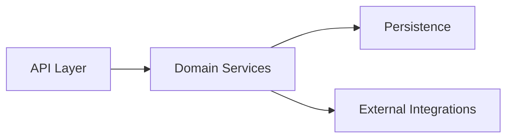

# compass — Specification

> Status: **Draft 1** (pre-implementation). This document is the contract. Implementation follows on approval.
> Date: 2026-05-12
> Author: Ashok Naik
> Inspired by: [CodeBoarding/CodeBoarding](https://github.com/CodeBoarding/CodeBoarding) (Python). This is a TypeScript-native, deliberately-slim port for the Claude Code plugin ecosystem, focused on the MERN stack (JavaScript/TypeScript).
> Change log vs. Draft 0: §1 sharpens the v1 user, §2 swaps "call & import graph" for "import graph", §4 replaces the single LLM call with a two-pass propose+critique, §5 adds `rationale` + recovery state, §6 adds `/compass-recover` and cost printing, §13 resolves four open questions (cross-file calls, `.compassignore` precedence, concurrency, depth cost) and opens two new ones.

---

## 1. Thesis

> **You can't review architecture you can't see.**

AI agents now write code faster than humans can read it. The pull-request diff shows *what* changed; it never shows *where in the system* it landed. Reviewers approve plausible-looking diffs against an architecture they can no longer hold in their head, and the second-order consequences — a leaky boundary here, a duplicate concept there, a circular dependency back — surface in production weeks later.

`compass` is a Claude Code plugin that keeps an architectural map of your codebase next to the code itself. It parses your JavaScript/TypeScript project, builds an **import graph**, asks an LLM (in two passes — propose then critique) to cluster the graph into named components, and writes Mermaid diagrams plus per-component Markdown into `.compass/`. On every re-run it does the smallest amount of work possible — only the components touched by your last commit get re-analyzed.

The shorthand: **Parse → Cluster → Propose → Critique → Render.** Re-runs are git-diff-driven, so the map stays cheap to keep in sync.

### 1.1 Who v1 is for

v1 is built for two users who already live inside Claude Code:

- **Maintainers** keeping a living map of a repo they already know — they re-run `/compass-refresh` after big commits and read `overview.md` before design discussions.
- **AI-coders inside Claude Code** who want the agent to read the map before it edits — `analysis.json` is machine-readable and Claude can be told to consult it.

Two users are explicitly **aspirational** for v1 and unlock later:

- **Reviewers** on GitHub PRs — unlocks in v0.4 when the GitHub Action ships. They cannot use v1 today without manually pasting Mermaid into PRs.
- **AI-coders outside Claude Code** (Cursor, Aider, Codex, …) — unlocks in v0.3 when a standalone CLI / MCP server ships. v1 is plugin-only.

This is a deliberate narrowing of "all users equal" — the v1 surface area only serves users with `claude` on their PATH. Acknowledging that up front is cheaper than discovering it in the field.

---

## 2. Scope — What ships in v1

We deliberately ship a **slim** subset of the CodeBoarding feature set. Six features only:

| # | Feature | One-line definition |
|---|---------|---------------------|
| 1 | **Full analysis** | Walk the repo, parse with tree-sitter, build the **import graph**, group into components, render |
| 2 | **Mermaid diagrams** | Every overview + component page emits a `graph LR` block ready to paste into PRs/docs |
| 3 | **Incremental analysis** | On re-run, only re-analyze files changed since the last run (git diff vs. cached manifest) |
| 4 | **`.compassignore`** | Gitignore-style exclude file at the repo root so vendored / generated dirs are skipped |
| 5 | **Two-pass LLM grouping** | Pre-cluster the import graph by co-import frequency, then **two** `claude -p` calls — *propose names+groupings* and *critique+revise* — produce the final component list with a `rationale` for each |
| 6 | **Depth levels** | `--depth N` (capped at 2 in v1) recursively expands each top-level component into its own sub-diagram |

**Architecture concern (not a feature):** a **pluggable backend interface** so non-Claude runtimes (Codex, OpenAI, local models) can be added later without rewriting. v1 ships **Claude only**; the env var `COMPASS_BACKEND` is **deliberately not implemented** until a second backend lands (no dead config).

**Language scope:** TypeScript + JavaScript (`.ts`, `.tsx`, `.js`, `.jsx`, `.mjs`, `.cjs`). MERN-focused. Other languages are a v2 conversation.

### 2.1 Explicitly out of scope for v1

The following exist in CodeBoarding and are **deliberately omitted** here. Adding them is a v2 conversation.

- **LSP-based static analysis** (we use **tree-sitter** instead — single npm dep, no spawned binaries)
- **Heuristic cross-file call resolution** — v1 graph contains *imports only*; "does `foo.bar()` here call the `bar` from `./utils`?" is not attempted. (Re-enabled in v0.2 behind `--precision=lsp`.)
- Languages beyond JS/TS (Python, Go, Java, PHP, Rust, C# in upstream)
- Multi-provider LLM (OpenAI, Gemini, Bedrock, Ollama, OpenRouter — we use `claude -p`, no `@anthropic-ai/sdk`)
- HTML / MDX / Sphinx renderers (Markdown + Mermaid only)
- Multi-agent pipeline beyond two passes (planner / abstraction / details / meta-validator in upstream)
- Partial analysis (regenerate one component by ID — `/compass-expand` covers the same need differently)
- Remote-repo URLs (`compass` runs in-session on an already-cloned repo)
- GitHub Action / CI integration (v0.4 deliverable)
- Standalone CLI (`npx compass`) and MCP server (v0.3 deliverable)
- VS Code / Open VSX extension (Claude Code is the host)
- Health endpoint / hosted service
- Monitoring / streaming stats writer
- Semantic vs. cosmetic diff classification

---

## 3. Distribution & Runtime Model

### 3.1 Distribution
`compass` ships as a **Claude Code plugin** installable via the marketplace:

```bash
claude plugin marketplace add AshokNaik009/compass
claude plugin install compass@compass
```

Once installed, every command is a slash-command-style trigger inside a Claude Code session. `claude` must be on PATH at runtime.

### 3.2 Runtime
Skills are markdown files (`SKILL.md`) that Claude reads and follows. When deterministic work is needed, the skill instructs Claude to invoke a TypeScript script via the bash tool:

```bash
npx tsx ${CLAUDE_PLUGIN_DIR}/scripts/<step>.ts --state .compass/state.json [args...]
```

`tsx` runs TypeScript inline — **no compile step**, in dev or in production. The ~300ms startup per script call is acceptable; commands make only a handful of calls.

### 3.3 LLM access
Two patterns, both using the user's existing Claude Code authentication — **no separate `ANTHROPIC_API_KEY` required**:

1. **In-session LLM work**: skills tell the active Claude session to do the LLM thinking directly, then write results back via a recording script.
2. **Headless LLM work inside scripts**: when a script needs LLM judgment without user attention, it shells out to `claude -p "<prompt>"` via `child_process.execSync`. Output is parsed (structured JSON requested in the prompt and validated via zod).

**Consequence:** the package has **zero AI SDK dependencies**. No `@anthropic-ai/sdk`, no `openai`, nothing. The intelligence lives in skill prompts and `claude -p` calls; the scripts are pure deterministic plumbing.

### 3.4 `claude -p` operational contract

Every shell-out follows a uniform contract in `src/lib/claude.ts`:

- **Timeout**: 60 seconds. Longer than that and the script fails with `CompassTimeoutError`; the user is told which step.
- **Token budget**: input prompt capped at ~80k tokens (rough character heuristic, 4 chars/token). If the pre-cluster graph exceeds this, the *lowest-weight inter-cluster edges* are dropped before the prompt is built; the drop is logged to `state.stats`.
- **JSON mode**: prompts always end with an explicit JSON schema and an instruction to return only valid JSON.
- **Retry**: one retry on parse failure, with a stricter prompt that includes the previous (invalid) response and the zod error. After that, fail loudly.
- **Cost**: token counts are recorded in `state.stats.tokens_{in,out}` per call. The skill prints a one-line cost summary at the end of every command.

---

## 4. Architecture

### 4.1 High-level

```
┌─────────────────────────────────────────────────────────┐
│                Claude Code (host)                       │
│                                                         │
│  ┌───────────────────────────────────────────────────┐  │
│  │  Skills (Markdown — instructions for Claude)      │  │
│  │  skills/{scan,refresh,expand,status,recover,help}/│  │
│  │  └── SKILL.md                                     │  │
│  └─────────────────┬─────────────────────────────────┘  │
│                    │ Claude reads skill, decides        │
│                    │ when to call scripts vs think      │
│                    ▼                                    │
│  ┌───────────────────────────────────────────────────┐  │
│  │  Scripts (TypeScript — pure deterministic logic)  │  │
│  │  scripts/*.ts  (run via `npx tsx`)                │  │
│  │  • Walk repo respecting .compassignore            │  │
│  │  • Parse TS/JS via tree-sitter                    │  │
│  │  • Build import graph                             │  │
│  │  • Cluster graph by co-import frequency           │  │
│  │  • Hash files for incremental diff                │  │
│  │  • Render Mermaid + Markdown                      │  │
│  │  • Shell out to `claude -p` for two-pass LLM      │  │
│  │    grouping (propose + critique)                  │  │
│  └─────────────────┬─────────────────────────────────┘  │
│                    │                                    │
│                    ▼                                    │
│  ┌───────────────────────────────────────────────────┐  │
│  │  State                                            │  │
│  │  .compass/analysis.json  (graph + components)     │  │
│  │  .compass/state.json     (manifest, file hashes,  │  │
│  │                           last-run metadata,      │  │
│  │                           phase, cost, lock)      │  │
│  │  .compass/.lock          (pidfile, single-writer) │  │
│  │  .compass/overview.md    (top-level diagram)      │  │
│  │  .compass/<comp>.md      (per-component pages)    │  │
│  │  .compassignore          (exclude file, at root)  │  │
│  └───────────────────────────────────────────────────┘  │
└─────────────────────────────────────────────────────────┘
```

### 4.2 Pipeline (the spine)

```
                ┌─────────────────────┐
                │ 1. Walk             │   respects .compassignore + .gitignore
                │                     │   yields list of TS/JS source files
                └──────────┬──────────┘
                           ▼
                ┌─────────────────────┐
                │ 2. Parse            │   tree-sitter parsers for TS, TSX, JS, JSX
                │                     │   extract: imports, exports, top-level decls
                └──────────┬──────────┘
                           ▼
                ┌─────────────────────┐
                │ 3. Resolve imports  │   match import specifiers to files
                │                     │   (tsconfig paths, package.json#main, relative)
                └──────────┬──────────┘
                           ▼
                ┌─────────────────────┐
                │ 4. Build graph      │   nodes = files
                │                     │   edges = import relations
                │                     │   weight = (# imported symbols actually used)
                └──────────┬──────────┘
                           ▼
                ┌─────────────────────┐   seeded Louvain on the undirected
                │ 5. Pre-cluster      │   weighted import graph
                │                     │   → ~5–20 clusters per repo
                └──────────┬──────────┘
                           ▼
                ┌─────────────────────┐   `claude -p` call 1/2:
                │ 6. LLM propose      │   "here are the clusters + member files
                │                     │   + inter-cluster edges. Propose names,
                │                     │   descriptions, and any regroupings."
                └──────────┬──────────┘   → { components[], edges[], rationale[] }
                           ▼
                ┌─────────────────────┐   `claude -p` call 2/2:
                │ 7. LLM critique     │   "here is your proposal + the same input.
                │                     │   Revise any shallow names ('Utilities',
                │                     │   'Core'), merge sparse clusters, and
                │                     │   strengthen rationale lines."
                └──────────┬──────────┘   → final { components[], edges[] }
                           ▼
                ┌─────────────────────┐
                │ 8. Render           │   write .compass/overview.md
                │                     │   write .compass/<component>.md
                │                     │   embed Mermaid graphs + rationale lines
                └─────────────────────┘
```

### 4.3 Backend abstraction

A single TS interface used as a design contract:

```ts
// src/backends/types.ts
export interface Backend {
  name: 'claude' | 'codex' | 'openai' | string;
  // Headless single-shot LLM call. Returns assistant text + token counts.
  oneShot(prompt: string, opts?: {
    json?: boolean;
    timeoutMs?: number;
  }): Promise<{ text: string; tokensIn: number; tokensOut: number }>;
  // Capabilities introspection — used to gate features per backend.
  capabilities(): { maxContextTokens: number };
}
```

v1 ships **`ClaudeBackend`** which implements `oneShot` by `execSync('claude -p ...')`. Adding an OpenAI backend later means writing `OpenAIBackend` that uses `fetch` against the OpenAI API — no other code changes needed.

**There is no runtime backend selector in v1.** The `COMPASS_BACKEND` env var is **not** read by any script. It is reserved for v0.3+ and is intentionally absent from `state.json`. Adding it before a second backend exists would be dead config.

---

## 5. Data Model

### 5.1 The analysis (`.compass/analysis.json`)

The structured result of one full or incremental run. Read by the renderer; written by the pipeline.

```jsonc
{
  "schema_version": 1,
  "run_id": "2026-05-12-103000",
  "generated_at": "2026-05-12T10:30:00Z",
  "depth": 1,
  "precision": "imports-only",   // future values: "imports+lsp"
  "project": {
    "name": "my-mern-app",
    "root": "/abs/path/to/repo",
    "languages": ["typescript", "javascript"],
    "file_count": 142,
    "loc": 18734
  },

  // Top-level component graph. Each component is a named cluster of files.
  "components": [
    {
      "id": "C1",
      "name": "API Layer",
      "description": "Express routes + middleware. Receives HTTP, validates input, delegates to services.",
      "rationale": "All 9 files import only from C2 (services) and C4 (validation); none import each other except via the central app.ts. Treated as a leaf of the import DAG.",
      "files": ["src/api/**", "src/middleware/auth.ts"],
      "symbols": ["app", "authMiddleware", "userRouter"],
      "depth": 1,
      "subgraph_ref": null,   // populated when depth > 1
      "confidence": "high"    // 'high' | 'medium' | 'low' — set by the critique pass
    },
    {
      "id": "C2",
      "name": "Domain Services",
      "description": "...",
      "rationale": "...",
      "files": ["src/services/**"],
      "symbols": ["UserService", "BillingService"],
      "depth": 1,
      "subgraph_ref": null,
      "confidence": "high"
    }
  ],

  // Edges between components (directed). Built by aggregating file-level import edges.
  "edges": [
    { "from": "C1", "to": "C2", "weight": 14, "reason": "Express handlers import service classes" },
    { "from": "C2", "to": "C3", "weight": 31, "reason": "Services import repository functions" }
  ],

  // Per-component sub-diagrams when --depth >= 2.
  "subgraphs": {
    // "C1": { components: [...], edges: [...] }
  },

  "llm": {
    "model": "claude-opus-4-7",
    "calls": [
      { "phase": "propose",  "tokens_in": 8421, "tokens_out": 1209, "duration_ms": 4302 },
      { "phase": "critique", "tokens_in": 9118, "tokens_out": 873,  "duration_ms": 3811 }
    ]
  }
}
```

### 5.2 The state file (`.compass/state.json`)

Single JSON file holding the live execution state, the **incremental manifest**, and recovery info. Read/written by every script. Easy to inspect, diff, and version-control.

```jsonc
{
  "schema_version": 1,
  "last_run_id": "2026-05-12-103000",
  "last_run_at": "2026-05-12T10:30:00Z",
  "last_commit_sha": "abc123def...",
  "depth": 1,

  // Lifecycle. Recovery uses this to resume / re-run a step.
  "phase": "done",   // 'walking' | 'parsing' | 'clustering' | 'proposing' | 'critiquing' | 'rendering' | 'done' | 'failed'
  "phase_started_at": "2026-05-12T10:29:51Z",
  "last_error": null,   // populated when phase == 'failed'

  // Single-writer file lock (pidfile mirror — actual lock lives at .compass/.lock).
  "lock_holder": null,   // { pid: 12345, started_at: "..." } when a script is running

  // File-level manifest used for incremental diff.
  "files": {
    "src/api/users.ts": {
      "sha256": "9f7c...",
      "mtime": "2026-05-10T14:22:00Z",
      "component_id": "C1"
    },
    "src/services/user.ts": {
      "sha256": "1a2b...",
      "mtime": "2026-05-10T09:11:00Z",
      "component_id": "C2"
    }
  },

  // Pinned dependencies that affect output stability.
  "pins": {
    "louvain_pkg": "graphology-communities-louvain@2.0.2",
    "louvain_seed": "9f7c1a2b"   // sha256(project_root)[:8]
  },

  "stats": {
    "files_parsed": 142,
    "files_skipped_ignore": 1204,
    "files_skipped_unchanged": 0,
    "clusters_pre_llm": 18,
    "components_post_llm": 7,
    "llm_calls": 2,
    "tokens_in_total": 17539,
    "tokens_out_total": 2082,
    "duration_ms": 9421
  }
}
```

### 5.3 The exclude file (`.compassignore`)

Lives at the **project root**, alongside `.gitignore`. Gitignore-style syntax (same `picomatch`-compatible globs). Walked first; anything matched is skipped before parsing.

```gitignore
# .compassignore
node_modules/
dist/
build/
coverage/
*.test.ts
*.spec.ts
__snapshots__/
.next/
```

If absent, compass falls back to: `node_modules/`, `dist/`, `build/`, `.git/`, `.next/`, `coverage/` as defaults plus everything in `.gitignore`.

**Precedence table** (resolved Q10 from Draft 0):

| Match in `.gitignore` | Match in `.compassignore` | `!include` in `.compassignore` | Result |
|---|---|---|---|
| no | no | n/a | **included** |
| yes | no | no | **excluded** (by `.gitignore`) |
| no | yes | no | **excluded** (by `.compassignore`) |
| yes | yes | no | **excluded** (either reason) |
| yes | n/a | yes (`!path/`) | **included** (compass override) |
| n/a | yes | yes (`!path/`) | **included** (explicit re-include) |

In words: union of excludes, with `!include` in `.compassignore` overriding both files. The same `!`-syntax `.gitignore` already supports.

### 5.4 The rendered output (`.compass/*.md`)

Two kinds of file:

**`overview.md`** — top-level diagram + a one-paragraph blurb per component, with links to the per-component pages.

```markdown
# my-mern-app — Architecture overview

> Generated by compass on 2026-05-12. Re-run with `/compass-refresh`.



## API Layer
Express routes + middleware. Receives HTTP, validates input, delegates to services.
*Why this grouping: All 9 files import only from C2 (services) and C4 (validation); none import each other except via app.ts. Treated as a leaf of the import DAG.*
→ [API_Layer.md](./API_Layer.md)

...
```

**`<component>.md`** — one page per component. Description, rationale, file list, symbol list, plus a *zoomed-in* Mermaid graph showing the component's internal structure (when `--depth >= 2`).

**Filename collisions** (resolved Q14 from Draft 0): default name is `<Component_Name>.md` (e.g. `API_Layer.md`). On collision (same name on two components), suffix with the component ID: `API_Layer.md`, `API_Layer__C7.md`. The renderer detects collisions before write.

---

## 6. Workflows (per skill)

### 6.1 `/compass-scan [--depth N]`

**Goal:** run a full analysis from scratch.

```
1. Acquire .compass/.lock (single-writer). If held by a live PID,
   abort with "another compass run in progress (pid X)".
   If stale (>10min), take over.
2. If --depth > 2, refuse with "v1 caps depth at 2".
3. Skill: invoke `npx tsx scripts/scan-init.ts --depth N`
   - Initializes .compass/state.json (phase='walking').
4. Skill: invoke `npx tsx scripts/scan-walk.ts`
   - Walks the repo respecting .compassignore + .gitignore.
   - Hashes every kept file (sha256).
   - Writes file list + hashes to state.json (phase='parsing').
5. Skill: invoke `npx tsx scripts/scan-parse.ts`
   - Parses each file with tree-sitter (TS/TSX/JS/JSX).
   - Extracts imports, exports, top-level fns, classes.
   - Resolves import paths (respects tsconfig.paths).
   - Writes import graph (nodes + edges) to state.json.
6. Skill: invoke `npx tsx scripts/scan-cluster.ts`
   - Runs seeded Louvain on the undirected weighted import graph.
   - Seed is sha256(project_root)[:8] for reproducibility.
   - Writes pre-LLM cluster assignment to state.json (phase='proposing').
7. Skill: if depth >= 2, print expected LLM-call cost
   ("This run will make 2 + 2*K = N LLM calls. Continue?")
   and wait for user confirmation.
8. Skill: invoke `npx tsx scripts/scan-propose.ts`
   - Shells out to `claude -p` (pass 1).
   - Prompt: clusters + member files + inter-cluster edges,
     asks for { components, edges, rationale } as JSON.
   - Validated via zod; one retry on parse failure.
   - Writes proposal to state.json (phase='critiquing').
9. Skill: invoke `npx tsx scripts/scan-critique.ts`
   - Shells out to `claude -p` (pass 2).
   - Prompt: original input + the proposal, asks to revise
     shallow names ('Utilities', 'Core'), merge sparse clusters,
     and strengthen rationale lines. Output is the revised JSON.
   - Writes components[] + edges[] to analysis.json.
10. If depth >= 2:
    - For each component, repeat steps 6–9 scoped to that
      component's file set, writing into analysis.subgraphs.
11. Skill: invoke `npx tsx scripts/scan-render.ts`
    - Reads analysis.json.
    - Writes .compass/overview.md and .compass/<component>.md
      with embedded Mermaid + rationale lines.
12. Skill: release lock, set phase='done'.
13. Skill: print summary
    - components found, files parsed, duration
    - tokens in/out per call, total cost estimate
    - point the user at .compass/overview.md.
```

### 6.2 `/compass-refresh`

**Goal:** incremental update — re-analyze only what changed.

```
1. Acquire lock.
2. Skill: invoke `npx tsx scripts/refresh-diff.ts`
   - Reads state.json (last run's file hashes + commit SHA).
   - Computes set of CHANGED files via:
     • git diff --name-only <last_commit_sha>..HEAD  (if git repo)
     • plus any tracked file whose sha256 changed (covers uncommitted).
   - Classifies the change:
     • SAFE: changed files all stay in their existing component.
     • UNSAFE: a changed file's neighbours suggest it belongs to a
       different cluster, or a new file landed with no cluster, or
       a file was deleted.
   - SAFE → partial refresh path; UNSAFE → fall through to full re-cluster.
3. Skill: if no changes, print "up to date" and exit.
4. Partial path:
   - `npx tsx scripts/refresh-reparse.ts --components <ids>`
     Re-parses only affected files. Updates state.files[] hashes + edges.
   - `npx tsx scripts/refresh-recritique.ts --components <ids>`
     Re-runs the *critique* pass only on affected components, with
     the rest of the analysis held fixed. One `claude -p` call.
   - `npx tsx scripts/scan-render.ts --components <ids>`
     Re-renders only the touched component pages + overview.md.
5. Full re-cluster path: run /compass-scan steps 5–11, reusing the
   already-walked file list to skip the walk step.
6. If state.json zod-validation fails at any point: warn the user,
   archive the broken file to .compass/state.broken.json, and fall
   back to /compass-scan from scratch.
7. Skill: release lock, print "refreshed N components in Ms" + cost line.
```

### 6.3 `/compass-expand <component-id> [--depth N]`

**Goal:** drill deeper into one component — generate a higher-depth sub-diagram for it without redoing the whole repo.

```
1. Acquire lock. Cap --depth at 2 in v1.
2. Skill: invoke `npx tsx scripts/expand-init.ts --component <id> --depth N`
   - Loads analysis.json, validates the component exists.
3. Skill: invoke `npx tsx scripts/expand-scope.ts --component <id>`
   - Collects the component's file set (already in analysis).
   - Builds the file-level import graph scoped to those files.
4. Skill: invoke `npx tsx scripts/scan-cluster.ts --scope <id>`
   - Runs seeded Louvain scoped to the component.
5. Skill: invoke `npx tsx scripts/scan-propose.ts --scope <id>`
   and `npx tsx scripts/scan-critique.ts --scope <id>`
   - Two-pass LLM names the sub-components within this component.
6. Skill: invoke `npx tsx scripts/scan-render.ts --component <id> --depth N`
   - Updates the component's .md page with the sub-graph.
   - Writes analysis.subgraphs[<id>] for future incremental runs.
7. Release lock, print cost line.
```

### 6.4 `/compass-status`

**Goal:** report current state of the analysis vs. the working tree.

```
Script: scripts/status.ts (read-only — does NOT acquire the lock).
1. Load state.json. If missing → print "no analysis yet — run /compass-scan".
2. If phase != 'done' → print "last run did not finish — run /compass-recover".
3. Compare current file hashes against state.files[]:
   - changed_files = files whose sha256 != stored hash
   - new_files = on-disk but not in state
   - deleted_files = in state but not on disk
4. Compute stale_components = union of components owning those files.
5. Print:
   - last run timestamp + depth
   - component count
   - "STALE: <N> components affected by <M> changed files"
   - suggestion: "Run /compass-refresh" if stale_components is non-empty.
```

### 6.5 `/compass-recover`

**Goal:** unblock a session whose previous compass run died mid-pipeline.

```
1. Read state.json. If phase == 'done', print "nothing to recover" and exit.
2. Check .compass/.lock:
   - If held by a live PID, refuse — that process is still running.
   - If stale or absent, proceed.
3. Branch on phase:
   - walking | parsing | clustering → resume from the failed step.
     (these are deterministic and idempotent; safe to re-run.)
   - proposing | critiquing → re-run /compass-scan from the
     pre-cluster snapshot already in state.json (no re-walking).
   - rendering → re-run scripts/scan-render.ts only.
4. Print "recovered to phase=done in Ms" + cost line.
```

### 6.6 `/compass-help`

**Goal:** print available commands. One-liner per command + a link to README.

---

## 7. Inventory

### 7.1 Skills (Markdown — what Claude reads)

| Skill dir | Trigger | Purpose |
|---|---|---|
| `skills/scan/SKILL.md` | `/compass-scan [--depth N]` | Full analysis from scratch |
| `skills/refresh/SKILL.md` | `/compass-refresh` | Incremental update via git diff |
| `skills/expand/SKILL.md` | `/compass-expand <id>` | Drill one component deeper |
| `skills/status/SKILL.md` | `/compass-status` | Manifest vs. working-tree diff (read-only) |
| `skills/recover/SKILL.md` | `/compass-recover` | Resume an interrupted run |
| `skills/help/SKILL.md` | `/compass-help` | Print available commands |

### 7.2 Scripts (TypeScript — deterministic logic)

| Script | Inputs | Outputs | LLM? |
|---|---|---|---|
| `scripts/scan-init.ts` | `--depth N` | state.json (phase=walking) | No |
| `scripts/scan-walk.ts` | (state.json) | file list + hashes in state.json | No |
| `scripts/scan-parse.ts` | (state.json) | import graph in state.json | No |
| `scripts/scan-cluster.ts` | `[--scope C]` | cluster assignment in state.json | No |
| `scripts/scan-propose.ts` | `[--scope C]` | proposal {components, edges, rationale} | Yes (`claude -p`) |
| `scripts/scan-critique.ts` | `[--scope C]` | revised components[] + edges[] in analysis.json | Yes (`claude -p`) |
| `scripts/scan-render.ts` | `[--components ids]` | overview.md + per-component .md | No |
| `scripts/refresh-diff.ts` | (state.json + git) | affected component ids + safe/unsafe classification | No |
| `scripts/refresh-reparse.ts` | `--components ids` | updated import graph in state.json | No |
| `scripts/refresh-recritique.ts` | `--components ids` | updated components in analysis.json | Yes (`claude -p`) |
| `scripts/expand-init.ts` | `--component id --depth N` | state.json (phase=clustering) | No |
| `scripts/expand-scope.ts` | `--component id` | scoped graph in state.json | No |
| `scripts/status.ts` | (state.json) | stale-component report (stdout) | No |
| `scripts/recover.ts` | (state.json) | resumes from the recorded phase | Maybe |

Scripts share helpers in `src/lib/`:

- `src/lib/state.ts` — load/save state.json with schema validation, lock acquire/release
- `src/lib/analysis.ts` — load/save analysis.json with zod validation
- `src/lib/walk.ts` — `.compassignore` + `.gitignore` walking, sha256 hashing
- `src/lib/parse.ts` — tree-sitter glue, AST → imports/exports/decls extraction
- `src/lib/resolve.ts` — import path resolution (tsconfig.paths, node resolution)
- `src/lib/graph.ts` — graph construction, seeded Louvain clustering, edge aggregation
- `src/lib/render.ts` — Markdown + Mermaid emitters, filename collision handling
- `src/lib/claude.ts` — `execSync('claude -p ...')` wrapper: timeout, JSON-mode template, retry-once, token counting
- `src/lib/git.ts` — `git rev-parse HEAD`, `git diff --name-only A..B`
- `src/lib/lock.ts` — `.compass/.lock` pidfile, stale detection (>10min)

---

## 8. Project Layout

```
compass/
├── README.md
├── SPEC.md                      # this file
├── LICENSE                      # MIT
├── package.json
├── tsconfig.json
├── .gitignore
├── .claude-plugin/
│   └── plugin.json              # Claude Code plugin manifest
├── commands/                    # slash-command entry points (markdown)
│   ├── compass-scan.md
│   ├── compass-refresh.md
│   ├── compass-expand.md
│   ├── compass-status.md
│   ├── compass-recover.md
│   └── compass-help.md
├── skills/
│   ├── scan/SKILL.md
│   ├── refresh/SKILL.md
│   ├── expand/SKILL.md
│   ├── status/SKILL.md
│   ├── recover/SKILL.md
│   └── help/SKILL.md
├── scripts/                     # Entry points (one per workflow step)
│   ├── scan-init.ts
│   ├── scan-walk.ts
│   ├── scan-parse.ts
│   ├── scan-cluster.ts
│   ├── scan-propose.ts
│   ├── scan-critique.ts
│   ├── scan-render.ts
│   ├── refresh-diff.ts
│   ├── refresh-reparse.ts
│   ├── refresh-recritique.ts
│   ├── expand-init.ts
│   ├── expand-scope.ts
│   ├── status.ts
│   └── recover.ts
├── src/
│   ├── lib/
│   │   ├── state.ts
│   │   ├── analysis.ts
│   │   ├── walk.ts
│   │   ├── parse.ts
│   │   ├── resolve.ts
│   │   ├── graph.ts
│   │   ├── render.ts
│   │   ├── claude.ts
│   │   ├── git.ts
│   │   └── lock.ts
│   ├── schema/
│   │   ├── analysis.ts          # zod schema for analysis.json
│   │   └── state.ts             # zod schema for state.json
│   ├── backends/
│   │   ├── types.ts             # design-time interface
│   │   └── claude.ts            # the only v1 implementation
│   └── prompts/
│       ├── propose-clusters.md  # template for scan-propose
│       ├── critique-clusters.md # template for scan-critique
│       └── refresh-recritique.md
├── tests/
│   ├── unit/                    # vitest unit tests for lib/, schema/
│   └── fixtures/                # sample repos, analysis snapshots
└── docs/
    ├── architecture.md          # condensed version of SPEC §4 for users
    ├── ignore-reference.md      # .compassignore syntax + precedence table
    └── recipes.md               # canned examples (vanilla Express, Next.js, CRA)
```

### 8.1 `.claude-plugin/plugin.json`

```json
{
  "name": "compass",
  "version": "0.1.0",
  "description": "See the architecture of your MERN codebase — generated by Claude, kept in sync with git.",
  "author": "Ashok Naik",
  "license": "MIT",
  "commands": [
    "commands/compass-scan.md",
    "commands/compass-refresh.md",
    "commands/compass-expand.md",
    "commands/compass-status.md",
    "commands/compass-recover.md",
    "commands/compass-help.md"
  ],
  "skills": [
    "skills/scan",
    "skills/refresh",
    "skills/expand",
    "skills/status",
    "skills/recover",
    "skills/help"
  ],
  "requires": { "node": ">=20" }
}
```

---

## 9. Dependencies (deliberately minimal)

**Runtime:**
- `tree-sitter` + `tree-sitter-typescript` + `tree-sitter-javascript` — parsing
- `graphology` + `graphology-communities-louvain` (pinned) — graph + seeded Louvain
- `picomatch` (~30kb) — gitignore-style glob matching for `.compassignore`
- `yaml` (~20kb) — config files
- `zod` — schema validation for analysis + state
- `tsx` — TypeScript execution (dev + runtime)

**Dev:**
- `typescript`
- `vitest` — unit tests
- `@types/node`

**Not used:**
- `@anthropic-ai/sdk` / `openai` — we use `claude -p`
- `commander` / `yargs` — scripts use `process.argv` parsing in <10 lines
- `chalk` / `ora` / TUI libs — Claude renders output
- Database driver — JSON state files
- MCP SDK — no MCP server in v1
- LSP clients — tree-sitter is enough for v1's imports-only precision
- `mermaid` runtime — we emit Mermaid source strings; rendering is the consumer's job

Target: **<12 production deps including transitive, <3MB installed** (tree-sitter native bindings are the bulk).

---

## 10. Build & Dev Workflow

```bash
# Local dev (no compile step)
npm install
npx tsx scripts/scan-walk.ts

# Tests
npm test          # vitest

# There is no production build step.
```

The plugin is **shipped uncompiled**: skills invoke `npx tsx scripts/*.ts` directly. Trade-off is ~300ms tsx startup per script call vs. zero install-time complexity. Acceptable given each skill makes only a handful of script calls per command. If startup ever becomes the bottleneck, the answer is a single long-lived `compass-server` script, not `tsc`.

---

## 11. Testing Strategy

- **Unit tests (vitest)** — every helper in `src/lib/` and every zod schema. No mocks for filesystem; use `tmp` directories with real I/O.
- **Fixture repos** — tiny synthetic MERN repos (`tests/fixtures/express-tiny/`, `tests/fixtures/next-app/`) drive end-to-end script tests.
- **Script smoke tests** — each `scripts/*.ts` has a test that runs against a fixture. `claude -p` calls are mocked at the `lib/claude.ts` boundary via `COMPASS_FAKE_CLAUDE`.
- **Real-fixture nightly** — one job runs `/compass-scan` against a checked-in public MERN repo with `COMPASS_RUN_REAL=1`, asserts that the rendered `overview.md` contains the expected component names. Gated to nightly only — not on PR CI — to keep the loop fast and avoid burning model calls per push.
- **No integration test against real Claude Code in v1** — validated manually via the recipes in `docs/recipes.md`.

Coverage target: **80% lines on `src/lib/` and `src/schema/`.** Scripts get smoke tests, not coverage targets.

`COMPASS_FAKE_CLAUDE='{"components":[...],"edges":[...]}'` env var short-circuits `claude -p` calls — used for unit tests + PR CI.

---

## 12. Roadmap

| Stage | Scope | When |
|---|---|---|
| **v0.1** (this spec) | All 6 features, imports-only graph, JS/TS only, Claude-only, two-pass LLM, manual recipes for validation | After spec approval |
| v0.2 | LSP-based call graph behind `--precision=lsp` (typescript-language-server). Python language support. | When user requests |
| v0.3 | Standalone CLI (`npx compass`) + MCP server. `COMPASS_BACKEND` env var activates. OpenAI / Gemini backends behind `Backend` interface. | When non-Claude-Code users surface |
| v0.4 | GitHub Action: regenerate on PR, commit diagrams, comment Mermaid into PRs (unlocks the reviewer user from §1.1) | After v0.1 stabilizes |
| v0.5 | Inline source-line references (clickable Mermaid → file:line). Per-package monorepo analysis. | If feedback asks for it |
| v1.0 | Stability promise + plugin marketplace listing | After v0.x bake-in |

---

## 13. Open Questions / Known Limitations

**Resolved in this draft** (kept for changelog clarity):

- ~~Cross-file call resolution precision~~ → v1 ships **imports-only**; LSP-based calls behind a flag in v0.2.
- ~~`.compassignore` precedence with `.gitignore`~~ → precedence table in §5.3.
- ~~Concurrent runs corrupting state.json~~ → `.compass/.lock` pidfile in §5.2 / §6.
- ~~Depth-level LLM cost~~ → hard cap at 2 in v1; prompt-for-confirm at depth ≥ 2 with predicted call count.
- ~~Filename collisions in rendered output~~ → suffix with component ID (§5.4).
- ~~Single LLM call producing shallow names~~ → two-pass propose + critique (§4.2 steps 6–7).

**Still open:**

1. **Dynamic / runtime-generated imports** (`require(variable)`, `await import(expr)`) are recorded as unresolved edges and surfaced in the component description. Acceptable for v1; rare in MERN repos that don't ship plugin systems.
2. **Monorepos.** v1 treats the repo root as the project. Workspaces (`packages/*`) work but cluster together. Per-package analysis is v0.5 territory.
3. **LLM JSON-mode reliability.** Two-pass design halves the blast radius of a malformed response (the critique pass can be re-run cheaply if it fails), but the propose pass still has a single retry-or-fail contract. If real-world failure rate is >5%, the propose pass needs a chain-of-thought scratchpad before the final JSON.
4. **Cluster stability across runs.** Louvain is non-deterministic on disconnected components. We seed the RNG (`seed = sha256(project_root)[:8]`) **and pin the Louvain package version**. Re-runs on the same commit must produce identical pre-cluster assignments. Verifying this stays stable across `npm install` cycles is an open test target.
5. **Mermaid diagram complexity ceiling.** Diagrams above ~30 nodes render poorly in most viewers. We cap top-level components at 12 (clusters above that merge in the critique pass); per-component sub-diagrams cap at 20 files (rest land in a textual "Other" bucket). Both caps are configurable in `.compassrc.json`.
6. **Cost transparency.** Every command prints a `tokens_in / tokens_out / est. cost` summary, but the *predicted* cost before the run is heuristic (file count × avg-tokens-per-file). If predictions undershoot by >2× on real repos, we owe users a calibration step before depth-2 runs.
7. **`.compass/` in version control.** We don't enforce check-in. Maintainers who commit it get free PR review context; teams that don't get a fresh map on every `/compass-scan`. The README should pick a recommendation rather than leaving it ambiguous — leaning toward **commit it**.

---

## 14. Acceptance Criteria for THIS spec

This spec is itself a seed. It's "approved" when the reader can answer **yes** to all of:

- [ ] I can describe in one sentence what `compass` does.
- [ ] I know which two users v1 actually serves and which two are aspirational.
- [ ] I know which 6 features ship in v1 and which CodeBoarding features were intentionally cut (LSP, multi-provider LLM, multi-agent pipeline beyond 2 passes, etc.).
- [ ] I can describe the runtime model (skills + tsx scripts + `claude -p`) without re-reading.
- [ ] I understand why there is no `@anthropic-ai/sdk` dependency and no `COMPASS_BACKEND` env var in v1.
- [ ] I can name the data files (`analysis.json`, `state.json`, `.compassignore`, `.compass/.lock`) and what each holds.
- [ ] I can describe the 8-stage pipeline (walk → parse → resolve → graph → cluster → propose → critique → render).
- [ ] I understand how `/compass-refresh` reuses last-run state and when it falls back to a full re-cluster.
- [ ] I know what `/compass-recover` does and why it exists.
- [ ] I see a clear v0.1 build path and it does not require LSP servers, a TUI, or a hosted backend.

If any are "no", either the spec needs editing or the design needs another grill-me round.

---

**End of spec. Approve to proceed to implementation.**
